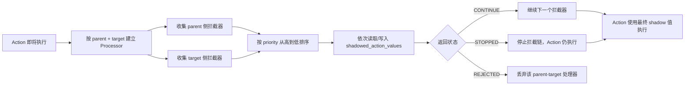

# Action Interceptor Reference

本文档整理当前项目中的 Action Interceptor（Action 拦截器），用于制作状态效果、遗物、运行修正器、敌人机制和特殊卡牌。内容以当前工作区源码为准：生产数据注册 **37 个**拦截器，测试数据另注册 **1 个**仅测试使用的拦截器，共覆盖 **38 个具体实现**。

拦截器不是 Action，也不会自行进入 `ActionHandler` 队列。它是在某个 Action 真正执行之前，读取并改写该 Action 的参数、拒绝某个目标上的执行，或触发额外副作用的一段处理逻辑。

## 与 Action 的关系

一个 `ActionInterceptorProcessor` 只代表一个“Action + 发起者 + 目标”组合。多目标 Action 会为每个目标建立独立 processor；无目标 Action 调用 `_intercept_action([])` 时，框架会用 `[null]` 建立一条仅处理 parent 侧拦截器的链。

特别注意 `ACTION_CARD_PLAY`：实际打牌时 `HandManager` 仍会提供 `[null] + 当前所有存活敌人`，但框架会先独立运行一次 `PARENT_ONCE` 链，再把它的 shadow 结果复制给每个目标 processor。因此扣层数、入队 Action、修改计数器等一次性副作用应声明为 `PARENT_ONCE`，不再依赖各脚本手写 `target == null` 防重。

## 核心数据结构

### `ActionInterceptorData`

| 字段 | 类型 | 默认值 | 准确作用 |
|---|---|---|---|
| `object_id` | `String` | 必填 | 拦截器数据 ID，例如 `interceptor_weaken`。状态、遗物、修正器和 Action 控制参数都引用这个 ID。 |
| `action_interceptor_script_path` | `String` | `""` | 具体 `BaseActionInterceptor` 脚本路径。每次建立拦截链时加载脚本并 `.new()`。 |
| `action_intercepted_action_paths` | `Array[String]` | `[]` | 正常注册时允许命中的 Action 脚本路径白名单。比较的是 `action.get_script().resource_path`，不按继承关系匹配。 |
| `action_interceptor_scope` | `int`（`ActionInterceptorData.INTERCEPTOR_SCOPES`） | `PARENT_PER_TARGET` | 决定注册来源和执行频率。`PARENT_ONCE` 每个 Action 运行一次并复制 shadow；`PARENT_PER_TARGET` 从发起者收集并对每个目标运行；`TARGET` 从当前目标收集。 |
| `action_interceptor_priority` | `int` | `0` | 越大越先执行。相同优先级按 `object_id` 降序排列，不按注册顺序排列。建议使用间隔较大的数值。 |

### `ActionInterceptorProcessor`

| 成员/方法 | 作用 |
|---|---|
| `parent_action` | 当前被拦截的 Action。可通过它访问 `parent_combatant`、`card_play_request`、`values` 和 Action 脚本路径。 |
| `target` | 当前处理器对应的单个目标；仅 parent 链时通常为 `null`。 |
| `shadowed_action_values` | 当前链累计产生的覆盖值。不要直接修改，应使用 getter/setter。 |
| `get_shadowed_action_values(key, default)` | 先应用当前 Action 的 `custom_key_names`，再读取已有 shadow 值；没有 shadow 时走 Action Value Hierarchy。 |
| `set_shadowed_action_values(key, value)` | 先应用 `custom_key_names`，再写入 shadow 层。不会原地改写 Action、卡牌原型或 `CardPlayRequest.card_values`。 |
| `get_effective_target_block()` | 按 `bypass_block` 返回本次正式伤害结算会使用的目标格挡。 |
| `get_incoming_health_damage()` | 将当前 shadow 总伤害换算为预计生命伤害。 |
| `set_incoming_health_damage(value)` | 将期望生命伤害换算回结算前总伤害，避免减伤拦截器与 `damage()` 重复扣格挡。 |

shadow 值位于 Action Value Hierarchy 之上，完整读取顺序为：

1. 当前 processor 已写入的 `shadowed_action_values`
2. 当前 Action 的 `values`
3. `CardPlayRequest.card_values`
4. `CardData.card_values`
5. `PlayerData.player_values`
6. 调用处默认值

`PARENT_ONCE` 的 shadow 是公共初始层，复制后每个目标仍拥有独立 shadow 字典。因此 Vulnerable 之类的 target 侧修正可以让同一次多目标攻击对不同敌人得到不同伤害。

## 返回状态

枚举定义于 `BaseActionInterceptor.ACTION_ACCEPTENCES`。源码名称保留了现有拼写 `ACCEPTENCES`。

| 枚举 | 数值语义 | 后续拦截器 | 当前 Action |
|---|---|---|---|
| `CONTINUE` | 接受并继续 | 继续运行 | 执行 |
| `STOPPED` | 接受但截断当前链 | 不再运行 | 执行 |
| `REJECTED` | 拒绝当前 parent-target 组合 | 不再运行 | 该 processor 不会返回，Action 不对这个目标执行 |

逐目标链中的 `REJECTED` 只取消当前目标；`PARENT_ONCE` 链中的 `REJECTED` 会取消整个 Action。预览模式会把 `REJECTED` 降级为继续，保证 UI 始终拿到 processor。`ACTION_CARD_PLAY` 仍不应在实际模式被拒绝，否则可能出现能量扣除和实际打牌流程不一致。

## 注册与生命周期

| 来源 | 数据字段 | 注册时机 | 注销时机 |
|---|---|---|---|
| 状态效果 | `StatusEffectData.status_effect_interceptor_ids` | 战斗单位首次获得该状态实例时 | 同 ID 最后一个状态实例被移除时 |
| 遗物 | `ArtifactData.artifact_interceptor_ids` | 玩家初始化遗物、获得遗物时 | 移除遗物时 |
| 运行修正器 | `RunModifierData.run_modifier_interceptor_ids` | Player 注册当前 Run 修正器时 | Run 结束统一清理 |
| 直接代码 | `ActionHandler.register_action_interceptor(combatant, id, source_key)` | 调用时 | 使用同一个 `source_key` 显式 unregister，或 Run 结束 |

`ActionHandler` 现在按 `combatant -> interceptor_id -> source_key` 保存来源引用。状态使用 `status:<状态 ID>`，遗物使用 `artifact:<object_uid>`，运行修正器使用 `run_modifier:<ID>`；只有最后一个来源注销后，拦截器才会从该战斗单位上消失。同一来源重复注册仍会去重。

## Action 侧控制参数

这三个参数由 processor 通过 shadow getter 读取，因此支持 Action Value Hierarchy 和 `custom_key_names`。

| 参数 | 类型 | 默认值 | 作用与边界 |
|---|---|---|---|
| `ignore_all_interceptors` | `bool` | `false` | 返回空拦截器列表，Action 仍正常执行。适合底层不可修改操作。 |
| `ignored_interceptor_ids` | `Array[String]` | `[]` | 同时从 parent 侧和 target 侧排除指定 ID。当前卡牌中用于忽略 Weaken、Pointy 等。 |
| `forced_interceptor_ids` | `Array[String]` | `[]` | 允许指定 ID 绕过注册来源要求；仍服从 ignored、Action 路径白名单和数据声明的作用域，同 ID 不重复。 |

当前冲突优先级为：`ignore_all_interceptors` 最高，随后 `ignored_interceptor_ids`，最后才处理 forced。forced 只绕过“是否已经注册”，不会绕过 `action_intercepted_action_paths` 或 `action_interceptor_scope`。若 forced 写在包装型 Generator 上，对应拦截器必须明确把该 Generator 列入路径白名单；`card_moss` 的 Overshield 加伤就是在 Attack Generator 层完成的。

## 预览模式

`preview_mode = true` 用于卡牌费用/可打出判断、手牌文本和敌人意图等预览。预览会运行同一套拦截链，这保证显示值与实际逻辑尽量一致，但也要求拦截器遵守两条规则：

1. 可以写 shadow 值，以便 UI 得到修正后的结果。
2. 不得扣状态、改计数器、消耗 RNG、发信号、加入 Action、使用消耗品或返回 `REJECTED`。

框架保证预览中的 `REJECTED` 不会丢弃 processor。Zero Day DB 预览只计算加层，Overflow Stack 预览只计算 shadow，Packet Sniffer 与自动复活则在预览中完全跳过 RNG、Action 入队和消耗品使用。

## 生产拦截器总表

“作用域”使用 `PO = PARENT_ONCE`、`PP = PARENT_PER_TARGET`、`T = TARGET`。未显式赋值的优先级使用默认值 `0`。

| ID | 作用域 | 优先级 | 命中 Action | 典型挂载来源 | 核心作用 |
|---|---:|---:|---|---|---|
| `interceptor_damage_increase` | PP | 10000 | `ACTION_ATTACK` | `status_effect_damage_increase` | 伤害加力量层数。 |
| `interceptor_weaken` | PP | 9500 | `ACTION_ATTACK` | `status_effect_weaken` | 伤害乘 `0.75` 后向下取整。 |
| `interceptor_vulnerable` | T | 9000 | `ACTION_ATTACK` | `status_effect_vulnerable` | 伤害乘 `1.5` 后向下取整。 |
| `interceptor_increase_turn_draw` | PP | 9000 | `ACTION_DRAW_GENERATOR` | `status_effect_increase_turn_draw` | 仅回合开始的常规抽牌增加层数。 |
| `interceptor_overshield` | T | 8000 | Attack、Direct Damage | `status_effect_overshield` | 在普通格挡之后消耗过载防火墙并降低伤害。 |
| `interceptor_preserve_energy` | PP | 10000 | `ACTION_RESET_ENERGY` | `status_effect_preserve_energy` | 拒绝能量归零。 |
| `interceptor_preserve_overshield` | T | 10000 | `ACTION_DECAY_STATUS` | `status_effect_preserve_overshield` | 仅拒绝过载防火墙的衰减 Action。 |
| `interceptor_pointy` | T | 0 | `ACTION_ATTACK` | `status_effect_pointy` | 入队反伤 Direct Damage。 |
| `interceptor_damage_from_overshield` | PP | 10000 | Attack Generator、Attack | 通常由 Action 强制注入 | 攻击伤害加发起者的过载防火墙层数。 |
| `interceptor_damage_from_block` | PP | 10000 | Attack Generator、Attack | 当前生产内容未挂载 | 攻击伤害加发起者当前格挡。 |
| `interceptor_negate_damage` | T | -10000 | Attack、Direct Damage | `status_effect_negate_damage` | 有穿透格挡伤害时耗 1 层并把伤害压到格挡值。 |
| `interceptor_cap_damage` | T | -9000 | Attack、Direct Damage | `status_effect_cap_damage` | 尝试把穿透格挡后的伤害限制到状态副层数。 |
| `interceptor_temp_preserve_block` | PP | 10000 | `ACTION_RESET_BLOCK` | `status_effect_temp_preserve_block` | 拒绝格挡清零。 |
| `interceptor_preserve_block` | PP | 10000 | `ACTION_RESET_BLOCK` | `status_effect_preserve_block` | 拒绝格挡清零。 |
| `interceptor_negate_debuff` | T | 10000 | `ACTION_APPLY_STATUS` | `status_effect_negate_debuff` | 耗 1 层并拒绝一次负面状态施加。 |
| `interceptor_rebound_card_plays` | PO | 10000 | `ACTION_CARD_PLAY` | `status_effect_rebound_card_plays` | 非复制、原去弃牌堆的牌改为回抽牌堆顶。 |
| `interceptor_duplicate_card_plays` | PO | 10000 | `ACTION_CARD_PLAY` | `status_effect_duplicate_card_plays` | 消耗 1 副层数，复制下一次非复制打牌。 |
| `interceptor_duplicate_attacks` | PO | 10000 | `ACTION_CARD_PLAY` | `status_effect_duplicate_attacks` | 消耗 1 主层数，复制下一张非复制攻击牌。 |
| `interceptor_consumable_auto_revive` | PP | 10000 | `ACTION_DEATH` | 自动 Run Modifier | 死亡检查前即时使用一个自动复活消耗品。 |
| `interceptor_negate_add_money` | PP | 10000 | `ACTION_ADD_MONEY` | `artifact_negate_money_gain` | 将正数 `money_amount` 压到 0，不阻止扣钱。 |
| `interceptor_reduce_add_money` | PP | 0 | `ACTION_ADD_MONEY` | `artifact_data_scarcity` | 金钱倍率减 `0.2`。 |
| `interceptor_increase_add_money` | PP | 0 | `ACTION_ADD_MONEY` | `artifact_data_abundance` | 金钱倍率加 `0.2`。 |
| `interceptor_increase_shop_price` | PP | 0 | 两种价格查询 | `artifact_inflation` | 价格倍率加 `0.25`。 |
| `interceptor_decrease_shop_price` | PP | 0 | 两种价格查询 | `artifact_deflation` | 价格倍率减 `0.25`。 |
| `interceptor_high_latency` | PP | 0 | `ACTION_DRAW_GENERATOR` | `status_effect_high_latency` | 回合开始的常规抽牌减少层数，但最低保留 1。 |
| `interceptor_brute_force_attack` | PP | 0 | `ACTION_ATTACK` | `artifact_brute_force_rig` | 玩家攻击牌产生的每段攻击伤害 `+2`。 |
| `interceptor_brute_force_draw` | PP | 0 | `ACTION_DRAW_GENERATOR` | `artifact_brute_force_rig` | 回合开始的常规抽牌数 `-1`，最低 0。 |
| `interceptor_zero_day_db` | PP | 0 | `ACTION_APPLY_STATUS` | `artifact_0day_database` | 每回合首次对敌施加 Vulnerable 时额外加遗物计数层。 |
| `interceptor_overflow_stack` | T | 0 | `ACTION_APPLY_STATUS` | `artifact_overflow_stack` | 玩家收到正层数 Debuff 时额外 `+1` 层。 |
| `interceptor_packet_sniffer` | PP | 0 | `ACTION_APPLY_STATUS` | `artifact_packet_sniffer` | 对敌施加正层数 Debuff 时 50% 入队抽 1。 |
| `interceptor_deadlock` | PO | 0 | `ACTION_CARD_PLAY` | `status_effect_deadlock` | 玩家有 Deadlock 时 shadow `card_is_playable = false`。 |
| `interceptor_root_privilege` | PO | 0 | `ACTION_CARD_PLAY` | `status_effect_root_privilege` | 费用超过当前能量时允许透支，并按缺口造成自伤。 |
| `interceptor_damage_threshold` | T | 0 | Attack、Direct Damage | `status_effect_damage_threshold` | 累计预计生命伤害，达阈值后切换意图/运行自定义 Action。 |
| `interceptor_card_play_reaction` | T | 0 | `ACTION_CARD_PLAY` | `status_effect_curiosity` | 统计玩家指定类型打牌，为目标触发状态奖励。 |
| `interceptor_card_play_reaction_self` | PO | 0 | `ACTION_CARD_PLAY` | `status_effect_curiosity2` | 分实例统计自身指定类型打牌并触发状态奖励。 |
| `interceptor_firewall_protocol` | PO | 0 | `ACTION_CARD_PLAY` | 隐藏状态 `status_effect_firewall_protocol` | 打出 `card_forge_fusion` 时执行状态自带玩家 Action。 |
| `interceptor_payload_turbine` | PP | 0 | `ACTION_APPLY_STATUS` | `status_effect_payload_turbine` | 每回合第一次获得载荷时，额外增加等同主层数的载荷。 |

测试数据额外定义 `interceptor_next_attack_free`：`PARENT_ONCE`、优先级 10000、命中 `ACTION_CARD_PLAY`，由 `status_effect_next_attack_free` 挂载。它会把下一张正费用、非 X 费攻击牌费用改为 0，并在实际非复制打牌时消耗 1 层；当前生产数据没有注册该 interceptor/status。

## 逐项参数与行为

### 伤害数值修正

#### `interceptor_damage_increase`

- 读取 shadow：`damage:int = 0`。
- 读取运行时：parent 的 `status_effect_damage_increase` 主层数。
- 写入 shadow：`damage = damage + 主层数`。
- 无实际副作用，预览可安全计算；parent 为空或死亡时拒绝当前目标。

#### `interceptor_weaken`

- 读取/写入：`damage:int = 0`。
- 算法：`int(damage * 0.75)`，Godot `int()` 会截断小数。
- 优先级 9500，位于 Damage Increase 之后、Vulnerable 之前。
- 红色卡牌 `card_type_cast` 通过 `ignored_interceptor_ids` 忽略它。

#### `interceptor_vulnerable`

- 读取/写入：`damage:int = 0`。
- 算法：`int(damage * 1.5)`。
- 虽然实现变量名叫 `parent_combatant`，在 `TARGET` 作用域中 `parent_action.parent_combatant` 仍是攻击者；它只用该对象做存活检查，倍率来源是固定常量，不读取 Vulnerable 层数。

#### `interceptor_brute_force_attack`

- 前置条件：parent 存活，且 `parent_action.get_action_card_data().card_type == CardData.CARD_TYPES.ATTACK`。
- 读取/写入：`damage:int = 0`，固定 `+2`。
- 命中的是每个 `ACTION_ATTACK`，多段攻击每段都加 2；非卡牌攻击不会获得加成。

#### `interceptor_damage_from_block`

- 读取运行时：parent 的 `get_block()`。
- 读取/写入：`damage:int = 0`，增加当前格挡值。
- 作用域为 `PARENT_PER_TARGET`，读取攻击发起者的格挡；当前生产内容没有状态或遗物挂载它。

#### `interceptor_damage_from_overshield`

- 读取运行时：parent 的 `status_effect_overshield` 主层数。
- 读取/写入：`damage:int = 0`，增加该层数。
- 作用域为 `PARENT_PER_TARGET`，当前主要通过 `forced_interceptor_ids` 使用。它同时允许命中 Attack Generator 和单段 Attack：`card_moss` 把 forced ID 配置在 Generator 上，因此先把当前 Overshield 层数写成生成器伤害，再生成实际 Attack。

### 伤害防御与反应

#### `interceptor_overshield`

- 读取 shadow：`damage:int = 0`、`bypass_block:bool = false`。
- 读取运行时：target 当前格挡、`status_effect_overshield` 主层数。
- 仅在 `damage > 有效格挡` 时消耗过载防火墙。`bypass_block = true` 时有效格挡按 0 计算。
- 使用 `get_incoming_health_damage()` 取得格挡后的预计生命伤害，最多吸收等同状态主层数的部分，再通过 `set_incoming_health_damage()` 换算回结算前总伤害。
- 实际模式消耗等同吸收量的状态层数，普通格挡最终只由 `target.damage()` 消耗一次。预览模式完全跳过 Overshield 防御，使敌人攻击意图和卡牌描述显示攻击输出值，而不是扣除防御储备后的生命伤害。

#### `interceptor_cap_damage`

- 读取 shadow：`damage`、`bypass_block`；读取 target 格挡和 `status_effect_cap_damage` 副层数。
- 通过统一 helper 取得预计生命伤害，并限制为 `min(预计生命伤害, 副层数)`，随后换算回结算前总伤害。
- 不消耗状态；实际与预览使用相同的纯 shadow 计算。普通格挡不会重复扣除。

#### `interceptor_negate_damage`

- 当统一 helper 计算出的预计生命伤害大于 0 时，实际模式消耗 `status_effect_negate_damage` 1 主层，并把期望生命伤害写为 0。
- 返回 `STOPPED`，因此优先级更低的拦截器不会继续运行。它当前优先级为 -10000，是伤害链末端保险。
- helper 会处理 `bypass_block`：绕过格挡时写回总伤害 0；不绕过时写回有效格挡值。预览会显示免伤结果但不扣状态层数。

#### `interceptor_pointy`

- 读取 target 的 `status_effect_pointy` 主层数。
- 实际模式生成 `ACTION_DIRECT_DAMAGE {damage = 层数, bypass_block = false}`，parent 为反伤持有者，目标为原攻击者，并插入 Action 队列前部。
- 不要求原攻击造成生命伤害，只要 `ACTION_ATTACK` 进入拦截链就触发；绿色卡牌已有通过 `ignored_interceptor_ids` 忽略 Pointy 的用法。
- 预览无副作用。

#### `interceptor_damage_threshold`

- 读取 shadow：`damage:int`、`bypass_block:bool`；按 target 当前格挡估算生命伤害。
- 状态主层数是当前阈值，副层数是累计伤害。
- 达阈值后：副层数清零，主层数增加 `damage_threshold_increase_amount`，并可生成切换意图和附加 Action。
- 状态 `custom_values`：

| 键 | 类型 | 默认值 | 作用 |
|---|---|---|---|
| `damage_threshold_increase_amount` | `int` | `20` | 每次触发后增加下一阶段阈值。 |
| `damage_threshold_target_intent` | `String` | `"intent_overheat"` | 非空时生成 `ACTION_CHANGE_ENEMY_INTENT_STATE`。 |
| `damage_threshold_actions` | `Array[Dictionary]` | `[]` | 达阈值时追加生成的任意 Action 数据。 |

- 预览无副作用。它在正式 `damage()` 前累计的是预测值；若后续低优先级拦截器继续改伤害，累计值可能与最终生命伤害不同。

### 抽牌、能量与格挡保留

#### `interceptor_increase_turn_draw`

- 仅当 shadow `is_start_of_turn_draw:bool = false` 为 `true` 时生效。
- `draw_count:int = 0` 增加 parent 的 `status_effect_increase_turn_draw` 主层数。
- 预览直接跳过；parent 为空或死亡时拒绝。

#### `interceptor_high_latency`

- 仅处理标记了 `is_start_of_turn_draw` 的回合开始常规抽牌；`draw_count` 减 parent 的 `status_effect_high_latency` 主层数。
- 原抽牌数大于 0 时最低保留 1。
- 预览跳过。实现未检查 parent 是否为空，强制错误使用会空引用。

#### `interceptor_brute_force_draw`

- 仅处理标记了 `is_start_of_turn_draw` 的回合开始常规抽牌；`draw_count` 固定减 1，最低 0。
- parent 为空或死亡时拒绝。无副作用，预览和实际得到相同 shadow 值。

#### `interceptor_preserve_energy`

- 实际模式直接 `REJECTED`，使 `ACTION_RESET_ENERGY` 的 processor 不返回，能量不归零。
- 预览返回 `CONTINUE`。不读取状态层数，是否生效完全由注册状态决定。

#### `interceptor_preserve_block` / `interceptor_temp_preserve_block`

- 两个脚本当前实现完全相同：实际模式拒绝 `ACTION_RESET_BLOCK`，预览继续。
- 差异仅在挂载状态的生命周期：永久保留状态不衰减，临时保留状态每回合衰减 1 层。

#### `interceptor_preserve_overshield`

- 命中所有 `ACTION_DECAY_STATUS`，读取 `status_effect_object_id:String`。
- 仅当 ID 为 `status_effect_overshield` 时拒绝；其他状态衰减继续。
- 不修改 `status_charge_amount`，也不阻止其他方式主动移除过载防火墙。

### 卡牌打出拦截器

#### `interceptor_rebound_card_plays`

- 依赖非空 `card_play_request`。
- 跳过 `is_duplicate_play == true`，并只处理 `card_destination_pile == HandManager.DISCARD_PILE`。
- 消耗 `status_effect_rebound_card_plays` 1 主层；把请求的目的地原地改成 `HandManager.DRAW_PILE`，策略改成 `HandManager.PILE_INSERTION_STRATEGIES.TOP`。
- 它直接修改 `CardPlayRequest`，不是 shadow 参数。数据作用域为 `PARENT_ONCE`，框架保证每次打牌只扣 1 层、只改写一次目的地，与敌人数无关。

#### `interceptor_duplicate_card_plays`

- 作用域为 `PARENT_ONCE`，跳过复制打牌；脚本中的 null 判断仅作为防御性保护。
- 使用 `status_effect_duplicate_card_plays` 的副层数作为剩余次数，每次消耗 1 副层。
- 新请求保留 card、selected target、`input_energy`、目的地和插入策略；`refundable_energy = 0`、`is_duplicate_play = true`。
- 未快照原请求 `card_values`，所以原牌在第一次打出期间发生的持久值变化可能影响复制结果。
- 成功复制后返回 `STOPPED`，阻止当前链中更低优先级拦截器继续处理 null 目标。

#### `interceptor_duplicate_attacks`

- 与 Duplicate Card Plays 流程相同，但只处理 `CardData.CARD_TYPES.ATTACK`，并消耗 `status_effect_duplicate_attacks` 主层数。
- `status_effect_block_on_special_discard` 目前也错误/复用地挂载了该拦截器，因此它实际获得的是“复制攻击牌”行为，而不是名称所暗示的特殊弃牌格挡。

#### `interceptor_next_attack_free`（仅测试数据）

- 只处理攻击牌；读取 shadow `card_energy_cost`，默认取卡牌实际费用。
- 直接写 `card_energy_cost = 0`。原费用小于等于 0、复制打牌或预览时不消耗状态；正费用实际打牌消耗 1 主层。
- 注释称跳过 variable cost，但实现只根据解析后的费用是否 `<= 0` 判断；当前 X 费约定为 0，因此间接跳过。
- 缺少 `card_play_request == null` 防护。

#### `interceptor_deadlock`

- 不读取 holder，而是全局读取 Player；玩家拥有任意正层数 `status_effect_deadlock` 时写 `card_is_playable = false`。
- 该 shadow 值由 `CardData.get_card_play_intercepted_action_results()` 和 `Card.can_play_card()` 使用。
- 无副作用，预览与实际一致。因为实际 `ACTION_CARD_PLAY` 不应被拒绝，它采用“不可打出标记”而不是 `REJECTED`。

#### `interceptor_root_privilege`

- 原费用来自 `card_data.get_card_energy_cost(true, true)`，当前能量来自 `Global.player_data.player_energy`。
- 仅当原费用高于当前能量时写 `card_energy_cost = 当前能量`、`card_is_playable = true`。
- 预览只改 shadow。`PARENT_ONCE` 保证实际模式每次打牌最多生成一次自伤，并把费用 shadow 复制给 UI/目标 processor。
- 自伤公式：`ceil((原费用 - 当前能量) * 副层数 / max(1, 主层数))`，生成 `ACTION_DIRECT_DAMAGE` 对 parent 自身造成伤害。
- 当前自伤未设置 `bypass_block`，因此可以被普通格挡吸收；这与“受到伤害”的文本是否一致需要内容规则明确。

#### `interceptor_firewall_protocol`

- 仅处理 `card_data.object_id == "card_forge_fusion"`；`PARENT_ONCE` 保证每次打牌触发一次。
- 查找 parent 的 `status_effect_firewall_protocol` 首个实例并调用 `perform_status_effect_actions()`。
- 状态自带 Action 当前为 `ACTION_BLOCK`，通过 `custom_key_names` 把 `block` 映射为 `invoking_status_effect_charges`，即获得等同状态主层数的格挡。
- 预览无副作用；parent 不存在或死亡时拒绝 CardPlay processor，这与 `ACTION_CARD_PLAY` 不应拒绝的约束有冲突风险。

#### `interceptor_card_play_reaction`

- `TARGET` 作用域，读取 target 的第一个 `status_effect_curiosity` 实例。
- 卡牌类型在 `curiosity_trigger_card_types` 中时计数；达到阈值后清零并给 target 生成指定状态。
- `target_override = BaseAction.TARGET_OVERRIDES.PARENT` 是相对于新生成 Action 的 parent（该 target 自己），所以奖励施加给状态持有者。

#### `interceptor_card_play_reaction_self`

- `PARENT_ONCE` 作用域；遍历 holder 上全部 `status_effect_curiosity2` 实例，每个实例独立计数。
- Curiosity 两种实现共用以下 `status_custom_values`：

| 键 | 类型 | 默认值 | 作用 |
|---|---|---|---|
| `curiosity_trigger_card_types` | `Array[int]` | `[]` | 允许触发计数的 `CardData.CARD_TYPES` 枚举值。 |
| `curiosity_trigger_threshold` | `int` | `1` | 触发所需张数。小于等于 0 会导致每次匹配都触发。 |
| `curiosity_current_counter` | `int` | `0` | 当前实例累计张数；拦截器会原地写回。 |
| `curiosity_reaction_status_id` | `String` | `""` | 达阈值时施加的状态 ID。空字符串不生成 Action。 |
| `curiosity_reaction_amount` | `int` | `0` | 施加主层数；必须大于 0。 |

### 状态施加拦截器

#### `interceptor_negate_debuff`

- 读取 shadow：`status_effect_object_id:String`、`status_charge_amount:int`。
- 若目标状态是 BUFF 且施加负层数，或是 DEBUFF 且施加正层数，则视为负面施加。
- 消耗 target 的 `status_effect_negate_debuff` 1 层并返回 `REJECTED`。
- 状态 ID 无效时记录错误并拒绝；预览直接继续。
- NEUTRAL 类型不会被阻止；给 DEBUFF 传负层数、给 BUFF 传正层数也不会被阻止。

#### `interceptor_payload_turbine`

- 只处理目标为玩家、状态 ID 为 `status_effect_turn_forge_load` 的 Apply Status。
- `status_effect_payload_turbine` 主层数是额外载荷，副层数是“本回合尚可触发”的门票。
- 有门票时写 `status_charge_amount = 原值 + 主层数`；实际模式把副层数直接清零。状态在 `PRE_DRAW_PLAYER_START_TURN` 通过自己的 Action 增加 1 副层。
- 预览保留数值改写但不消耗门票，符合预览规则。
- 数据脚本路径当前使用裸字符串，`Scripts.gd` 没有对应 `INTERCEPTOR_PAYLOAD_TURBINE` 常量。

#### `interceptor_zero_day_db`

- 仅处理玩家对 Enemy 施加 `status_effect_vulnerable`。
- 每回合第一次触发时，读取 `artifact_0day_database.artifact_counter` 并增加到 shadow `status_charge_amount`；仅在实际模式写 `player_values["artifact_0day_database_triggered"] = true`。
- 回合重置由 `ArtifactZeroDayDB.gd` 管理。
- 预览会展示额外 Vulnerable 层数，但不会占用“本回合首次”或发出遗物信号。

#### `interceptor_overflow_stack`

- `TARGET` 作用域，只处理 target 为玩家、目标状态类型为 DEBUFF、`status_charge_amount > 0` 的情况。
- 写 `status_charge_amount = 原值 + 1`；仅实际模式发出 `artifact_proc`，预览保持纯 shadow 计算。

#### `interceptor_packet_sniffer`

- `PARENT_PER_TARGET` 作用域，只处理玩家对 Enemy 施加正层数 DEBUFF。
- 使用 `Global.player_data.get_player_rng("rng_artifacts")` 做 50% 判定；成功时生成无 parent、无 target 的 `ACTION_DRAW_GENERATOR {draw_count = 1}` 并发出遗物信号。
- 预览在 RNG 判定前直接返回，不消耗确定性轨道、不入队 Action、不发信号。

### 金钱与价格

#### 倍率型拦截器

`interceptor_reduce_add_money`、`interceptor_increase_add_money`、`interceptor_increase_shop_price`、`interceptor_decrease_shop_price` 共用同一协议：

| shadow 参数 | 类型 | 默认值 | 作用 |
|---|---|---|---|
| `money_amount_multiplier` | `float` | `1.0` | 链式累计倍率；金钱加减 0.2，商店价格加减 0.25。 |
| `base_money_amount` | `int` | 当前 `money_amount` | 固定原始基数，避免多个倍率拦截器对已乘结果继续复乘。 |
| `money_amount` | `int` | `0` | 当基数大于 0 时写成 `int(base * multiplier)`。 |

这四个实现是纯 shadow 计算，预览安全。倍率是加法叠加，例如 +20% 与 -20% 同时存在时回到 1.0，而不是 `1.2 * 0.8`。

#### `interceptor_negate_add_money`

- 读取/写入 `money_amount:int = 0`，算法为 `min(money_amount, 0)`。
- 只阻止获得正数金钱，负数仍可用于扣钱。
- 优先级 10000，高于默认优先级的倍率拦截器；它先把金额设为 0 后，倍率拦截器会把 0 保存为基数，因此最终仍为 0。

### 自动复活

#### `interceptor_consumable_auto_revive`

- 命中 parent 的 `ACTION_DEATH`，扫描玩家全部消耗品槽位，查找首个 `consumable_auto_revive`。
- 找到后调用 `ActionGenerator.generate_use_consumable(parent, slot, true)`，要求消耗品 Action 立即执行，然后返回 `STOPPED`。
- 它不直接拒绝死亡；复活消耗品必须在死亡 Action 后续检查前恢复生命。
- 当前没有 `preview_mode` 防护，但死亡 Action 目前没有常规预览路径。

## 常量与枚举依赖

### 框架枚举/常量

| 定义 | 使用位置 | 含义 |
|---|---|---|
| `BaseActionInterceptor.ACTION_ACCEPTENCES` | 全部拦截器 | `CONTINUE`、`STOPPED`、`REJECTED`。 |
| `CardData.CARD_TYPES` | Brute Force、Duplicate Attacks、Next Attack Free、Curiosity | 判断 ATTACK/SKILL/POWER 等卡牌类型。Curiosity 的数组应存枚举整数，不应写显示文本。 |
| `StatusEffectData.STATUS_EFFECT_TYPES` | Negate Debuff、Overflow Stack、Packet Sniffer | `BUFF`、`DEBUFF`、`NEUTRAL`。 |
| `BaseAction.TARGET_OVERRIDES.PARENT` | Reaction、Damage Threshold | 生成子 Action 时指向新 Action 的发起者。 |
| `HandManager.DISCARD_PILE` / `DRAW_PILE` | Rebound | 判断和改写牌堆目的地。 |
| `HandManager.PILE_INSERTION_STRATEGIES.TOP` | Rebound | 将牌放到抽牌堆顶。 |

### 硬编码对象 ID

多个拦截器把状态、遗物、卡牌和 RNG 轨道 ID 写在脚本内部，制作内容时必须与这些字符串一致：

| 类别 | ID |
|---|---|
| 状态 | `status_effect_damage_increase`、`status_effect_overshield`、`status_effect_negate_damage`、`status_effect_cap_damage`、`status_effect_pointy`、`status_effect_next_attack_free`、`status_effect_rebound_card_plays`、`status_effect_duplicate_card_plays`、`status_effect_duplicate_attacks`、`status_effect_high_latency`、`status_effect_vulnerable`、`status_effect_deadlock`、`status_effect_root_privilege`、`status_effect_curiosity`、`status_effect_curiosity2`、`status_effect_firewall_protocol`、`status_effect_payload_turbine`、`status_effect_turn_forge_load`。 |
| 遗物 | `artifact_0day_database`、`artifact_overflow_stack`、`artifact_packet_sniffer`。 |
| 卡牌 | `card_forge_fusion`。 |
| 消耗品 | `consumable_auto_revive`。 |
| RNG 轨道 | `rng_artifacts`。 |
| 意图默认值 | `intent_overheat`。 |

## 顺序与组合示例

假设基础攻击伤害为 10，攻击者有 2 层 Damage Increase 和 Weaken，目标有 Vulnerable。当前优先级顺序为：

1. Damage Increase（10000）：`10 + 2 = 12`
2. Weaken（9500）：`int(12 * 0.75) = 9`
3. Vulnerable（9000）：`int(9 * 1.5) = 13`

如果希望乘区先于加法区，必须调整优先级；注册顺序不会改变结果。相同优先级也不能依赖数组顺序，因为框架会按 ID 降序排序。

多目标攻击时，每个目标从相同 Action 基础值建立独立 shadow 链。敌人 A 有 Vulnerable、敌人 B 没有，则 A 的 processor 写入放大伤害，B 的 processor 保留原值，彼此不会污染。

## 已完成的底层修正

| 位置 | 当前结果 |
|---|---|
| Packet Sniffer | 预览在 RNG 前返回，不再消耗 RNG、抽牌或发信号。 |
| Zero Day DB | 预览只计算 shadow，实际模式才提交首次触发标记和信号。 |
| Overflow Stack | 预览保留 `+1` shadow，但不发遗物信号。 |
| Rebound 与 CardPlay 单次效果 | 新增 `PARENT_ONCE` 阶段，真实副作用与敌人数解耦。 |
| Overshield / Cap / Negate Damage | 共享生命伤害换算接口，修复重复扣格挡和 bypass 分支。 |
| forced interceptors | 只绕过注册；ignored、Action 路径和作用域均继续生效。 |
| 注册生命周期 | 改为来源引用计数，移除一个状态/遗物不会误注销其他来源。 |
| Damage From Block/Overshield | 改为 `PARENT_PER_TARGET`，与实现读取 parent 的语义一致。 |

## 后续设计审计

| 级别 | 位置 | 当前问题 | 面向大量内容的建议 |
|---|---|---|---|
| 中 | Duplicate Card / Duplicate Attacks | 大量复制请求构建逻辑重复。 | 提取共享复制函数，参数化卡牌类型过滤与消耗主/副层数。 |
| 中 | Preserve Block 两个实现 | 脚本完全重复。 | 共用一个拒绝型拦截器数据，差异由状态生命周期表达。 |
| 中 | 金钱/价格四个倍率实现 | 仅常量不同，逻辑重复。 | 提取通用倍率 delta 拦截器，并把 delta 放入 `ActionInterceptorData` 配置。 |
| 低 | Payload Turbine | 已注册但没有 `Scripts` 常量，数据使用裸路径。 | 增加统一常量，避免路径重命名遗漏。 |
| 低 | Next Attack Free | 只有测试数据，生产常量存在但生产注册缺失。 | 明确标注测试专用，或迁入生产数据并补正式内容。 |
| 低 | 多个脚本 | 状态/遗物 ID 散落为裸字符串，部分常量未实际使用。 | 建立领域 ID 常量表或由 InterceptorData 提供配置参数。 |
| 低 | Interceptor 文件位置 | Root Privilege 位于 `scripts/actions/interceptors/`，其余位于 `scripts/action_interceptors/`。 | 移到统一目录，降低扫描和 Mod 覆盖成本。 |

## 新拦截器规范

1. 新脚本继承 `BaseActionInterceptor`，保持无实例状态；持久计数放在状态、遗物或 PlayerData 中。
2. 在 `Scripts.gd` 声明路径常量，在生产数据生成器注册 `ActionInterceptorData`，再由状态/遗物/修正器挂载。
3. 所有可修改 Action 参数都用 processor 的 shadow getter/setter，不直接改 `parent_action.values` 或卡牌原型。
4. 明确使用 `PARENT_ONCE`、`PARENT_PER_TARGET` 还是 `TARGET`。一次性 CardPlay 副作用使用 `PARENT_ONCE`，不要依赖手写 null 判断。
5. 明确优先级所属阶段：基础加法、倍率、减伤、封顶、最终取消等，不依赖同优先级注册顺序。
6. 预览模式只做纯 shadow 计算；不得修改状态、遗物、PlayerData、CardPlayRequest，不得调用 RNG、发信号或加入 Action。
7. 对 `parent_combatant`、`target`、`card_play_request`、数据 ID 查询结果做空值检查；被强制注入时上下文不一定完整。
8. 若返回 `STOPPED`，文档必须说明为什么后续拦截器不应继续；若返回 `REJECTED`，必须说明是取消单目标还是整个语义操作。
9. 可配置内容优先放在数据层，避免把状态 ID、倍率、阈值、概率和生成 Action 硬编码进脚本。
10. 至少验证实际执行、预览、零目标、单目标、多目标、重复打牌和同优先级组合六种场景。

## 本轮底层改造验证清单

| 场景 | 建议内容 | 预期结果 |
|---|---|---|
| forced 命中 Generator | 使用绿色卡 `card_moss`（寄生脚本） | 获得 8 层过载防火墙后，Generator 生成 8 点 Attack；实际造成 8 点基础伤害，不能为 0。 |
| 格挡 + Overshield | 目标有 5 格挡、3 Overshield，受到 10 点非穿透伤害 | 格挡与 Overshield 各消耗 5/3，最终只失去 2 生命。 |
| Overshield 与敌人意图 | 玩家拥有任意 Overshield，观察敌人攻击意图 | 意图数字保持敌人的攻击输出，不随玩家 Overshield 层数下降；真实攻击时才消耗 Overshield。 |
| 格挡 + Cap Damage | 目标有 5 格挡、Cap 副层数 3，受到 10 点非穿透伤害 | 最终失去 3 生命，不是 0；格挡只结算一次。可用 `card_verdant`（翠绿脚本）获得 Cap。 |
| bypass + Negate Damage | 有 1 层伤害阻断时受到 10 点 `bypass_block = true` 伤害 | 生命不减少，伤害阻断消耗 1 层。可用“壳中幽灵”遗物获得状态。 |
| CardPlay 单次作用域 | 场上放置 2 个以上敌人，给玩家 Rebound/Duplicate 状态后打一张牌 | 无论敌人数多少，只消耗 1 次状态、只生成 1 次复制或回抽。 |
| Root 费用预览 | 使用 `card_root_privilege` 后，把能量降到低于另一张牌费用 | 手牌显示可用当前能量打出；实际只产生一次透支自伤，与敌人数无关。 |
| Zero Day 预览纯净 | 持有“Oday数据库”，反复悬停/选中一张施加 Vulnerable 的牌 | 悬停不触发遗物动画、不占用首次效果；实际第一次施加时额外 +2 层且只触发一次。 |
| Packet Sniffer 预览纯净 | 持有“抓包工具”，反复预览施加 Debuff 的牌 | 预览不抽牌、不播放遗物触发、不推进 `rng_artifacts`；只有实际施加时进行 50% 判定。 |
| Overflow Stack 预览纯净 | 持有“溢出堆栈”，预览敌人给玩家施加的 Debuff | 预览只显示层数 +1，不播放遗物触发；实际施加时才发信号。 |
| 多来源引用计数 | 同时保有两个都注册同一 interceptor ID 的来源，再移除其中一个 | 另一个来源仍然生效；只有最后一个来源移除后才注销拦截器。现有 `status_effect_duplicate_attacks` 与 `status_effect_block_on_special_discard` 可用于验证。 |
| ignored 胜过 forced | 调试 Action 同时写入同一个 ID 的 `forced_interceptor_ids` 与 `ignored_interceptor_ids` | 该拦截器不执行。 |

## 覆盖情况

- `Scripts.gd` 当前有 37 个 `INTERCEPTOR_*` 常量。
- 生产数据当前注册 37 个 `ActionInterceptorData`。
- `interceptor_payload_turbine` 有生产数据和实现，但没有 `Scripts` 常量。
- `interceptor_next_attack_free` 有实现、常量和测试数据，但没有生产数据。
- `InterceptorBaseNegateStatusDecay` 是辅助基类，不是可直接挂载的具体效果；`ActionInterceptorProcessor` 和 `BaseActionInterceptor` 是框架类，不计入 38 个具体实现。
